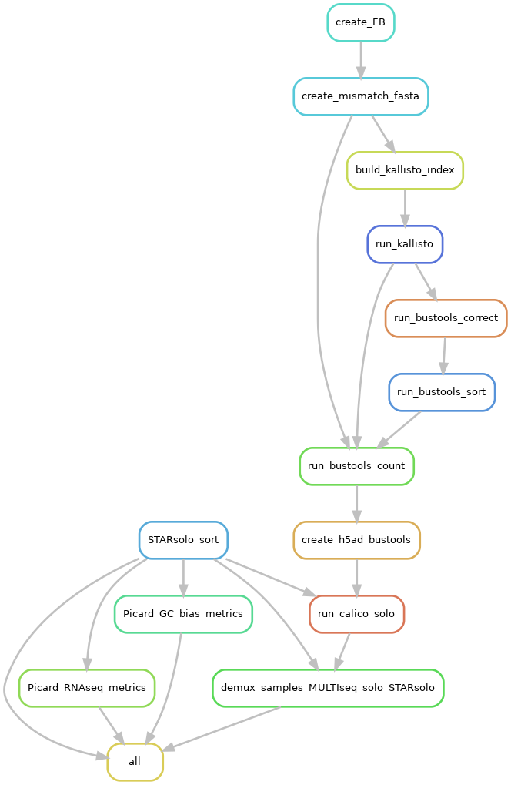

# scRNA_snRNA_Pipeline
Snakemake Pipeline with "selectable" modules

## Requirements
This pipeline depends on the following packages/programs:
<ul>
	<li><a href="https://scanpy.readthedocs.io/en/stable/">Scanpy Manual</a></li>
	<li><a href="https://snakemake.readthedocs.io/en/stable/">Snakemake Manual</a></li>
	<li><a href="https://github.com/alexdobin/STAR/blob/master/docs/STARsolo.md">STARsolo Manual</a> </li>
	<li><a href="https://broadinstitute.github.io/picard/command-line-overview.html#CollectGcBiasMetrics">GC bias metrics Info</a></li>
	<li><a href="https://broadinstitute.github.io/picard/command-line-overview.html#CollectRnaSeqMetrics">RNA seq metrics Info</a></li>
	<li><a href="https://github.com/pachterlab/kite">KITE <i>(kallisto indexing and tag extraction)</i></a></li>
	<li><a href="https://cellsnp-lite.readthedocs.io/en/latest/manual.html">cellSNP Manual</a></li>
	<li><a href="https://vireosnp.readthedocs.io/en/latest/manual.html">vireoSNP Manual</a></li>
	<li><a href="https://github.com/calico/solo#how-to-demultiplex-cell-hashing-data-using-hashsolo-cli">hashsolo Info</a></li>
</ul>

### Packages installed through conda
All the packages installed through anaconda3/2018.12 for Python 3.9.5 are described [here](requirements/requirements_conda.txt)

### Packages installed through pip
All the packages installed for R version 4.1.0 are described [here](requirements/requirements_pip.txt)

## Overview of the pipeline
Directed Acyclic Graph of the whole pipeline:


## Settiung up profiles
The info for setting up profiles for different HPC's is mentioned [here](https://github.com/Snakemake-Profiles)

## Executing Pipeline
This pipeline can be executed by executing (in case of HPC, submitting) the script called `run_snakemake.sh`

```Shell
sh run_snakemake.sh
```

## Selectable Modules

<ul>
<li> all (STARsolo + PICARD's RNAseq metrics + GCBias metrics + kallisto-bustools-calico solo demultiplexing)</li>
<li> STARsolo</li>
<li> STARsolo_rnaseqmet</li>
<li> STARsolo_gcbiasmet</li>
<li> STARsolo_kb_solo</li>
<li> STARsolo_PICARD</li>
<li> STARsolo_gt_demux (WIP)</li>
<li> STARsolo_splitbams (WIP)</li>
</ul>

### Module Specifications
<dl>
	<dt>Whole Pipeline</dt>
	<dd>This module includes alignment through STARsolo and PICARD's both programs (GcBiasMetrics and RnaSeqMetrics)</dd>
	<dt>STARsolo</dt>
	<dd>Only alignemnt through STARsolo.</dd>
	<dt>STARsolo_rnaseqmet</dt>
	<dd>This module will execute STARsolo and PICARD's RNAseq metrics.</dd>
	<dt>STARsolo_gcbiasmet</dt>
	<dd>This module will execute STARsolo and PICARD's GC bias metrics.</dd>
	<dt>STARsolo_kb_solo</dt>
	<dd>This module will execute STARsolo, kallisto_bustools, and demultiplexing by calico_solo/hashsolo.</dd>
	<dt>STARsolo_PICARD</dt>
	<dd>This module will execute STARsolo, PICARD's RNAseq metrics, and PICARD's GC bias metrics.</dd>
	<dt>STARsolo_gt_demux <i>(Not yet implemented)</i></dt>
	<dd>This module will execute cellSNP and vireoSNP</dd>
</dl>


