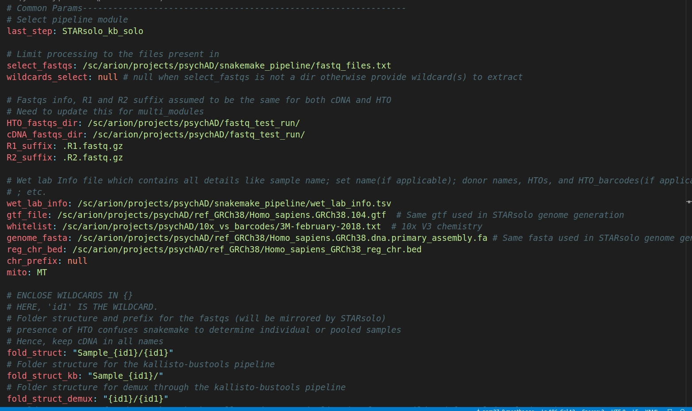

# Demultiplex pooled snRNA seq datasets

This setup shows one complex workflow that will be simplified and streamlined by this pipeline. To make it more interesting, this tutorial will annotate individual samples through genotype based demultiplexing (using cellSNP-vireoSNP workflow) as well as HTO based demultiplexing (using kite-hashsolo workflow).

## Configuration File

To begin with any utilisation of this pipeline starts with setting up the configuration file *new_config.yaml*

### Overview

This yaml config file (new_config.yaml) has all relevant options for each rule present in this pipeline. Furthermore, this file has been sectioned, through comments, into separate sub-workflow modules in a way containing rule-specific options/parameters (ocurring in the order of their appearance in the sub-workflow scripts). Typically, there are certain parameters that need not be changed irrespective of the project the pipeline is being used for

### Common (project-specific) parameters

The following pictures showcase parameters that are project-specific.
:::{figure-md}

new_config.yaml (Part 1)
:::

#### Module selector

**last_step**:
    This is the key which needs to be fed one of the {ref}`pre-selected modules <modules:Selectable Modules>`

